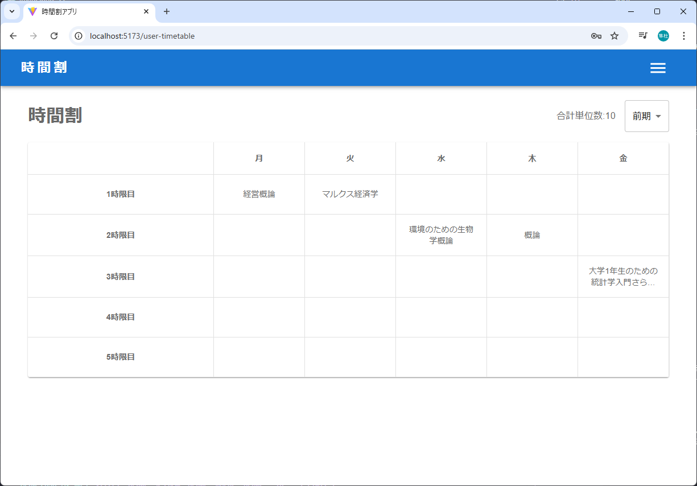
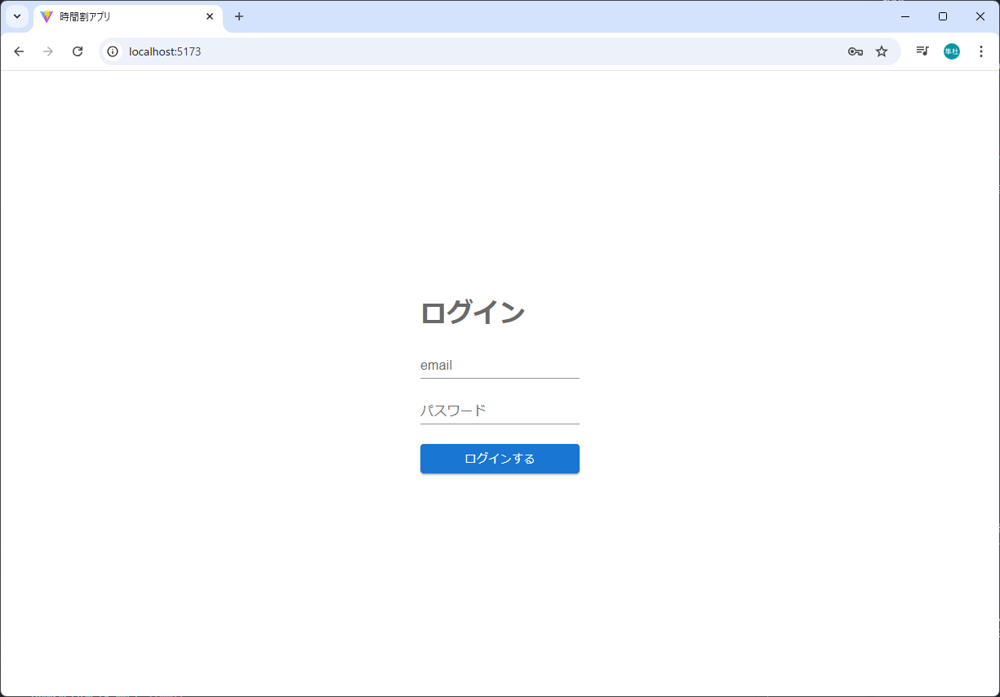
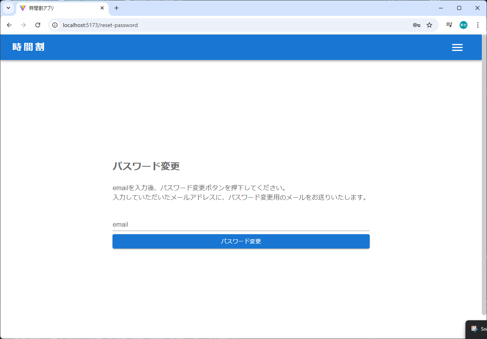
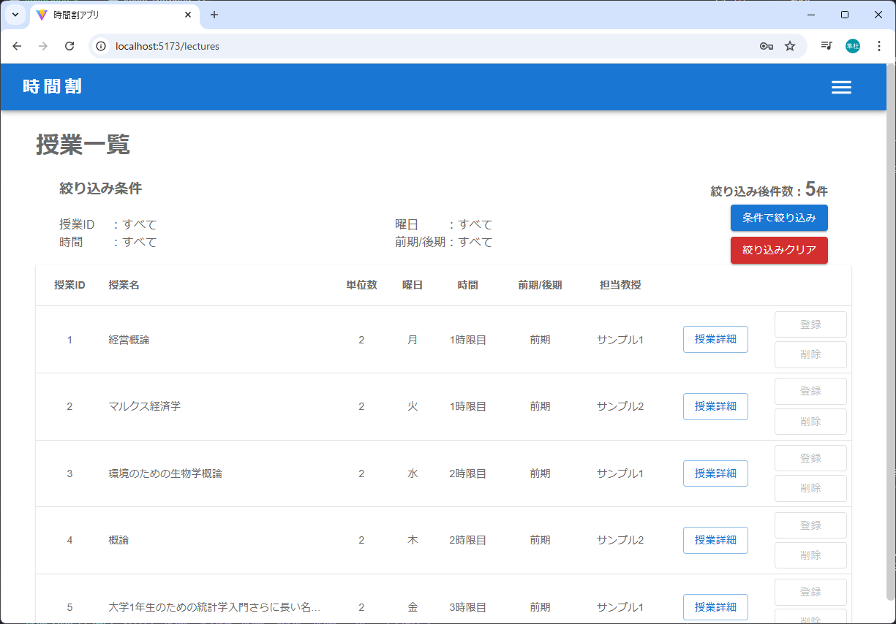

# 学校時間割システム



## 概要
このシステムは学生が授業の時間割を管理できるWebアプリケーションです。
フロントエンドはReact、バックエンドはRails APIで構築されています。

## 主な機能

### 認証機能
- ユーザー登録（メールアドレス認証）
- ログイン/ログアウト
- パスワードリセット（メール送信）
- パスワード変更
- セッション管理（devise_token_auth）




### 時間割管理機能
- 時間割の表示（月〜金、1〜5限）
  - 授業名、教員名、単位数の表示
  - セルホバー時のハイライト表示
  - 2行を超える授業名は省略表示
- 前期/後期の切り替え
- 合計単位数の自動計算
- 授業の登録/削除
  - 空きコマをクリックして授業を登録
  - 登録済みの授業をクリックして削除
  - 重複登録のチェック
  


### 授業一覧機能
- 全授業の一覧表示
- 検索・フィルタリング
  - 曜日・時限での絞り込み
  - 授業名での検索
  - 教員名での検索
- 単位数での並び替え



### セキュリティ機能
```ruby
# GET /api/v1/timetables/:id 対象ユーザの時間割を取得する
def show
  # 自分以外のデータを閲覧しないように、ログインユーザとリクエストのidをチェック
  if current_api_v1_user.id != params[:id].to_i
    render status: 450
    return
  end

  timetable = Timetable.select('timetables.day_of_week, timetables.time, timetables.period, lectures.lecture_id, lectures.lecture_name, lectures.credit_count, teachers.teacher_name ')
                       .joins('INNER JOIN lectures ON timetables.lecture_id = lectures.lecture_id INNER JOIN teachers ON lectures.teacher_id = teachers.teacher_id ')
                       .where(
                         'timetables.user_id = ?', params[:id]
                       )
  render json: timetable
end
```

## 技術スタック

### フロントエンド
- React 18.2
- TypeScript 5.2
- Vite 5.1
- Material-UI 5.15
- Emotion（スタイリング）
- Redux Toolkit（状態管理）
- React Router v6（ルーティング）

### バックエンド
- Ruby 3.2.3
- Rails 7.1.3
- MySQL 8.0
- devise_token_auth（認証）
- rack-cors（CORS対応）

## UI/UXの特徴

### デザイン
- Material-UIベース
- レスポンシブ対応
- アニメーション効果
  - ローディング表示
  - モーダル表示/非表示
  - ホバーエフェクト

### スタイリング実装例
```ts
const TdTableCell = styled(TableCell)`
  color: #696969;
  text-align: center;
  font-weight: 500;
  cursor: pointer;
  border-right: 1px solid #e0e0e0;
  :hover {
    background-color: #bce2e8;
  }
  padding: 1rem;
  height: 70px;
  width: 160px;

  /* 動的に文字数が変わるため、2行を超える場合の3点リーダ設定 */
  div {
    overflow: hidden;
    display: -webkit-box;
    -webkit-box-orient: vertical;
    -webkit-line-clamp: 2;
  }
`;
```

## 開発環境/本番環境

### 開発環境
- フロントエンド: `http://localhost:5173`
- バックエンド: `http://localhost:3000`
- CORS設定済み

### 本番環境
- AWS EC2でのホスティング
- Nginx + Pumaの構成
- SSL/TLS対応
- 本番用CORS設定

## 作者
champaya